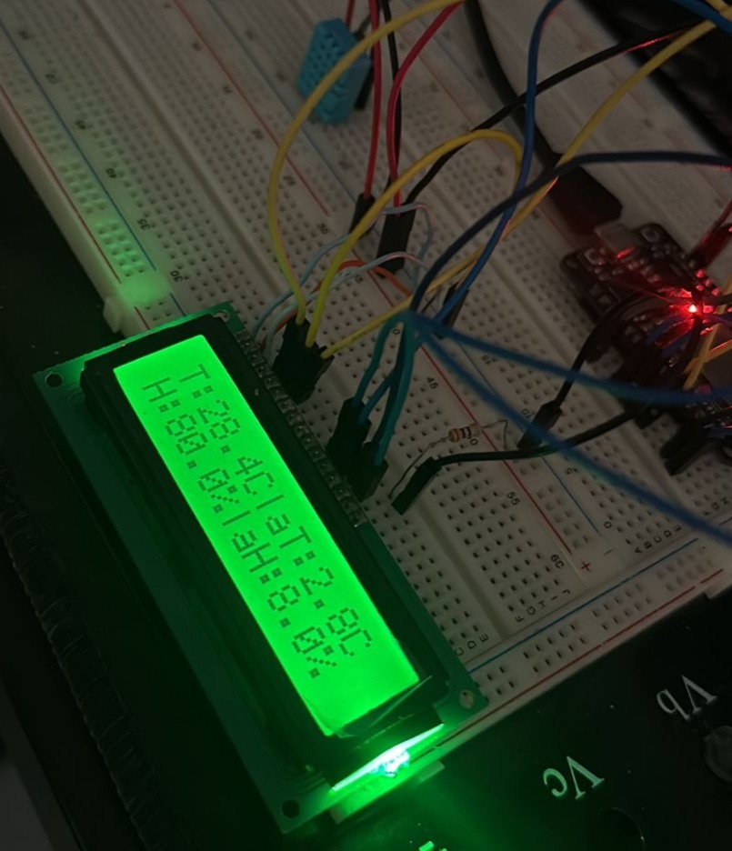
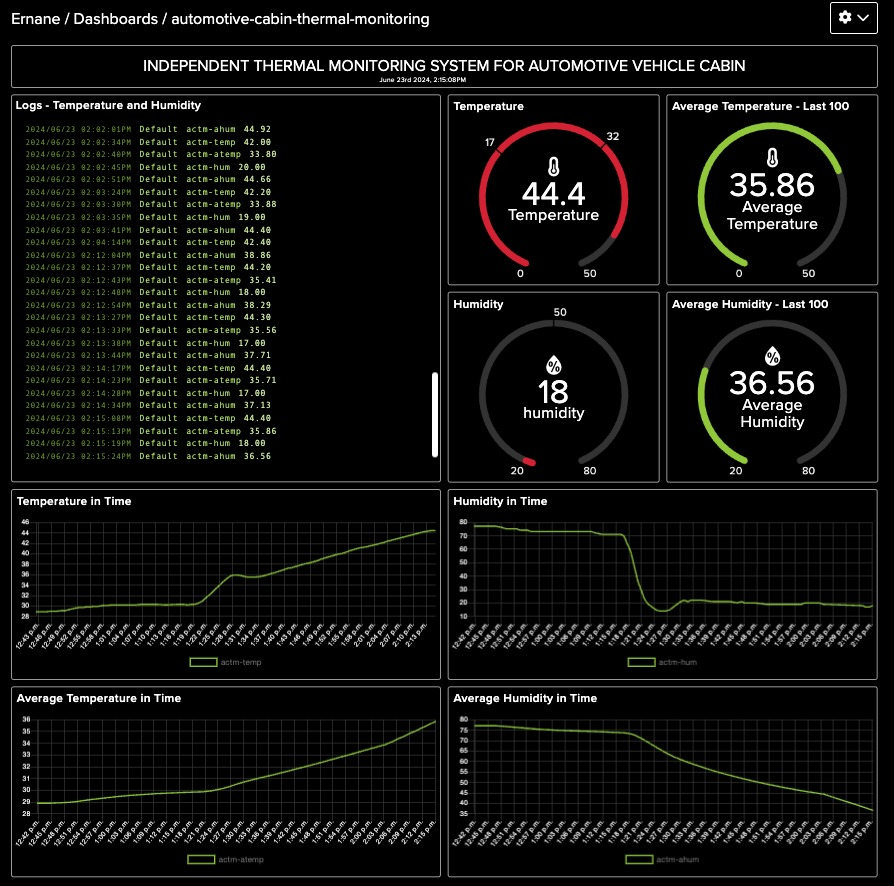
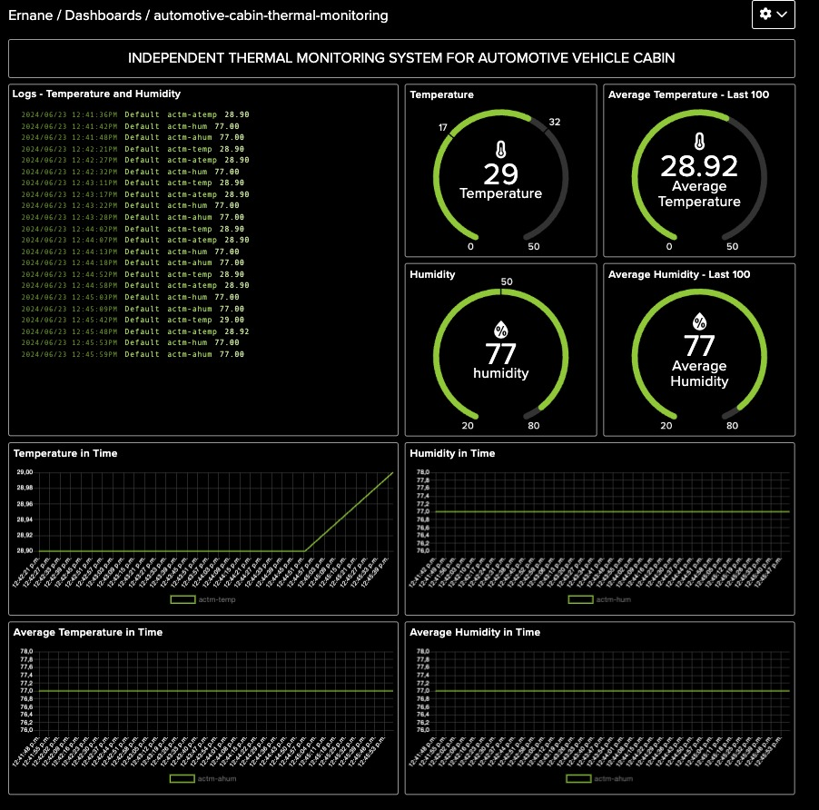

# Independent Thermal Monitoring System - IoT
This project aims to develop and implement an independent thermal monitoring IoT device inside the cabin of automotive vehicles. Using a DHT11 sensor, the device collects temperature and humidity data, which are processed by an ESP32 microcontroller. The data are displayed in real-time on an LCD screen and sent to the cloud via Wi-Fi, where they are stored and visualized on dashboards. The system provides continuous monitoring of the environmental conditions in the cabin, ensuring comfort and safety for the occupants.

The development methodology included requirements gathering, device programming, and initial prototyping, resulting in an efficient and robust solution. It encompasses the conception and assembly of the device to the practical tests conducted. The components used, the integration process in the vehicle, the configuration of the communication system with the Adafruit broker, and the results obtained during field tests will be discussed.

| Device |
|:-------------------:|
||

## Implementations
For this application, the MQTT protocol was used to send data to a broker, specifically Adafruit's broker, as discussed earlier. Communication at the hardware implementation level was developed using an ESP32 with Wi-Fi connection, utilizing the wifi.h and wificlient.h libraries. Additionally, the PubSubClient.h library was employed to establish the connection between the application and the broker.

After connecting to Wi-Fi, we connect to the MQTT broker, and then the data publishing process begins. All four desired variables are populated and calculated before we send the captured data via serial communication, using the DHT library to collect data from the DHT11 sensor.

Now, we need to configure the Adafruit broker. After accessing the website and creating an account, we can create the necessary feeds simply by naming them. There, we find our username, the key required for connection, and even some examples of how to perform the integration. These are the only pieces of information needed to connect to the broker and send our data, along with the key for each feed, which, in the basic case, corresponds to their respective names. This way, we can connect to the broker. With everything configured and the data arriving in our feeds, we can use Adafruit's server to present them in a more interesting way. In each feed's panel, there is a line graph, as shown in the links below.

### Feeds

- [ITMS - **Dashboard**](https://io.adafruit.com/Ernane/dashboards/automotive-cabin-thermal-monitoring);
- [ITMS - Average Humidity **Feed**](https://io.adafruit.com/Ernane/feeds/actm-ahum);
- [ITMS - Average Temperature **Feed**](https://io.adafruit.com/Ernane/feeds/actm-atemp);
- [ITMS - Humidity **Feed**](https://io.adafruit.com/Ernane/feeds/actm-hum);
- [ITMS - Temperature **Feed**](https://io.adafruit.com/Ernane/feeds/actm-temp).

| Dashboard Preview 1 | Dashboard Preview 2 |
|:-------------------:|:-------------------:|
|| |

## Practical Tests
The development of the solution followed a structured methodology, beginning with the requirements gathering, which included identifying the needs for thermal monitoring inside automotive vehicle cabins, specifying the necessity to measure and visualize temperature and humidity in real-time, as well as storing this data in the cloud for later analysis. Following this, tests were conducted under different conditions to ensure the system's robustness and to demonstrate the system's implementation in the real-use environment. Below are videos of the prototype implementation.
- [Testing Wi-Fi Connectivity](https://youtube.com/shorts/GmuC_Umvizc)
- [Testing Prototype in a Vehicle](https://youtu.be/GmuC_Umvizc)

## Results and Discussions
Through an iterative process of development, testing, and refinement, we ensured that the solution was robust and met the specified requirements, providing an effective way to monitor thermal conditions in the cabin of automotive vehicles. In the end, we found that this device is useful both for independently evaluating the vehicle's air conditioning performance and for conducting a quantitative analysis of exposure to different temperatures.

## ✍️ Authors

- [Ernane Ferreira](https://github.com/ernanej) 🧑🏼‍💻
- [Quelita Míriam](https://github.com/quelita2) 👩🏼‍💻
---

  📚 IMD0902 - INTRODUCTION TO THE INTERNET OF THINGS (2024.1 - 24M56) 🎓  
  Federal University of Rio Grande do Norte - Digital Metropolis Institute (IMD). 🏛️

